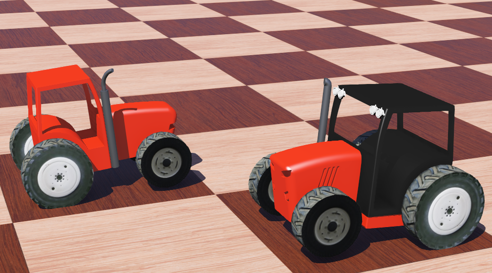

# Model Description

- [Model Description](#model-description)
  - [Tractor PROTO](#tractor-proto)
    - [PROTO Field Summary](#proto-field-summary)
  - [Engine Output](#engine-output)
  - [Robot Window](#robot-window)
  - [Sensor Slot](#sensor-slot)
    - [Accelerometer](#accelerometer)
      - [Description](#description)
      - [Field Summary](#field-summary)
    - [GPS](#gps)
      - [Description](#description-1)
      - [Field Summary](#field-summary-1)
    - [Gyro](#gyro)
      - [Description](#description-2)
      - [Field Summary](#field-summary-2)
    - [InertialUnit](#inertialunit)
      - [Description](#description-3)
      - [Field Summary](#field-summary-3)

## Tractor PROTO

This section describes fields of **Kubota** and **McCormick** proto.


### PROTO Field Summary

```c
Proto {
  SFVec3f    translation                    0 0 0
  SFRotation rotation                       0 1 0 0.0
  SFString   name                           "vehicle"
  SFString   controller                     "void"
  SFString   controllerArgs                 ""
  SFFloat    suspensionFrontSpringConstant  100000
  SFFloat    suspensionFrontDampingConstant 4000
  SFFloat    wheelsDampingConstant          5
  SFFloat    maxSteeringTorque              10000
  SFFloat    brakeCoefficient               700
  SFFloat    engineMinRPM                   1500
  SFFloat    engineMaxRPM                   4500
  SFVec3f    engineFunctionCoefficients     150 1 0
  SFNode     physics                        Physics{}
  MFFloat    gearRatio                      [-12 8 12 16 20 24]
  MFNode     sensorSlot                     [Accelerometer{}
                                            GPS {}
                                            Gyro{}
                                            InertialUnit{}]
}
```

- `translation`: Defines the translation from the world coordinate system to the vehicle's coordinate system.
- `rotation`: Defines an arbitrary rotation of the children's coordinate system with respect to the parent coordinate system.
This field contains four floating point values: *rx, ry, rz* and α.
The first three numbers, *rx ry rz*, define a normalized vector giving the direction of the axis around which the rotation must be carried out.
The fourth value, α, specifies the rotation angle around the axis in radians.
- `name`: Name of the solid.Note that the name should preferably identify the vehicle uniquely.
- `controller`: Name of the controller program that the simulator must use to control the robot.
This program is located in a directory whose name is equal to the field's value.
This directory is in turn located in the "controllers" subdirectory of the current project directory.
- `controllerArgs`: String containing the arguments (separated by space characters) to be passed to the `main` function of the C/C++ controller program.
- `suspension...`: Defines the characteristics of the front wheels suspension.
- `wheelsDampingConstant`: Defines the `dampingConstant` of each wheel joint used to simulate the frictions of the vehicle.
- `maxSteeringTorque`: Defines the maximum torque applied on the y-axis of the front wheels.
- `brakeCoefficient`: Defines the maximum `dampingConstant` applied by the `Brake` on the wheels joint.
- `engineMinRPM and engineMaxRPM`: Defines the working range of the engine (`engineMinRPM` not used in case of `electric` `engineType`).
- `engineFunctionCoefficients`: Define the coefficients of the second order function used to approximate the output torque as a function of the rotational speed of the motor.
- `physics`: Node of the vehicle defining the physical parameters of the vehicle.
- `gearRatio`: Defines the total (not only the gearbox ratio) ratio between the rotational speed of the engine and the wheels, the number of elements defines the number of gears, the first element is the reverse gear.
- `sensorSlot`: Defines the sensors mounted on the tractor, and their mounting locations are determined by their `translation` and `rotation` fields.

## Engine Output

The output torque of the **combustion engine** is computed in following steps.
First the rotational speed of the engine is estimated from the rotational speed of the wheels, then the output torque of the engine is computed (the formula depends on the engine type) using the rotational speed of the engine, then this output torque is multiplied by the state of the throttle and the gearbox coefficient, finally the torque is distributed (respecting the differential constraint) on the actuated wheels.

If `a`, `b` and `c` are the values of the `engineFunctionCoefficients` parameter of the **tractor PROTO**, the output torque is:

```c
output_torque = c * rpm^2 + b * rpm + a
```

> **Note**: if the rpm is below the `engineMinRPM` parameter of the **tractor PROTO**, `engineMinRPM` is used instead of the real rpm, but if the rpm is above the `engineMaxRPM` parameter, then the output torque is 0.

## Robot Window

Robot windows can be opened by double-clicking on the virtual robot, or using the `context menu`.

In addition to the usual tabs for each sensors/actuators, the robot-window's first tab gives a quick overview of the vechile state.

The following tabs give more detailed information about one specific state of the car (e.g. speed, steering angles, wheels encoders, etc.).
After those specific tabs about vechile, you can find the usual tabs regarding sensors/actuators added in the sensors slots of the vechile.


## Sensor Slot

This section decribes fields of Accelerometer, GPS, Gyro and Inertial Unit which are pre-mounted on a tractor with flexible locations.

<div align=center>


</div>

For more detialed about functions of sensors, please refer to [Sensors](https://www.cyberbotics.com/doc/guide/sensors).

### Accelerometer

```c
Accelerometer {
  MFVec3f lookupTable [ ]    # lookup table
  SFBool  xAxis       TRUE   # {TRUE, FALSE}
  SFBool  yAxis       TRUE   # {TRUE, FALSE}
  SFBool  zAxis       TRUE   # {TRUE, FALSE}
  SFFloat resolution  -1     # [0, inf)
}
```

#### Description

The `Accelerometer` node can be used to model accelerometer devices such as those commonly found in mobile electronics, robots and game input devices.
The `Accelerometer` node measures acceleration and gravity induced reaction forces over 1, 2 or 3 axes.
It can be used for example to detect fall, the up/down direction, etc.

An `Accelerometer` at rest with earth's gravity will indicate 1 g (9.81 m/s^2) along the vertical axis.
Note that the gravity can be specified in the `gravity` field in the `WorldInfo` node.
To obtain the acceleration due to motion alone, this offset must be subtracted.
The device's output will be zero during free fall when no offset is substracted.

#### Field Summary

- `lookupTable`: This field optionally specifies a lookup table that can be used for mapping the raw acceleration values [m/s^2] to device specific output values.
By default the lookup table is empty and therefore the raw acceleration values are returned (no mapping).
See the section on the `DistanceSensor` node for more explanation on how a `lookupTable` works.

- `xAxis, yAxis, zAxis`: Each of these boolean fields enables or disables computation for the specified axis.
If one of these fields is set to FALSE, then the corresponding vector element will not be computed and will return *NaN* (Not a Number).
For example, if `zAxis` is FALSE, then second element of the array returned by the `wb_accelerometer_get_values` function will always be *NaN*.
The default is that all three axes are enabled (TRUE).
Modifying these fields makes it possible to choose between a single, dual or three-axis accelerometer and to specify which axes will be used.

- `resolution`: This field allows to define the resolution of the sensor, the resolution is the smallest change that it is able to measure.
For example, if `resolution` is 0.2 instead of returning 1.767 the sensor will return 1.8.
Setting this field to -1 (default) means that the sensor has an 'infinite' resolution (it can measure any infinitesimal change).
This field accepts any value in the interval (0.0, inf).

### GPS

```c
GPS {
  SFString type             "satellite"   # {"satellite", "laser"}
  SFFloat  accuracy         0             # [0, inf)
  SFFloat  noiseCorrelation 0             # [0, 1]
  SFFloat  resolution       -1            # {-1, [0, inf)}
  SFFloat  speedNoise       0             # [0, inf)
  SFFloat  speedResolution  -1            # {-1, [0, inf)}
}
```

#### Description

The `GPS`node is used to model a Global Positioning Sensor (GPS) which can obtain information about its absolute position from the controller program.

#### Field Summary

- `type`: This field defines the type of GPS technology used like "satellite" or "laser" (currently ignored).

- `accuracy`: This field defines the precision of the GPS, that is the standard deviation (expressed in meter) of the gaussian noise added to the position.

- `noiseCorrelation`: If a more accurate gps noise model than the simple gaussian noise is required, this field can be used to define the noise correlation level.
The noise model is then approximated by a gaussian-correlated phenomena, which capture for example the drift phenomena present in GPS.
The value should be between 0 and 1 and represents how much the noise from 1 second ago influence the current noise, 0 means no influence (i.e. no correlation) and 1 means that the noise will be constant (noise fully correlated with the noise from one second ago).
Internally the correlation factor corresponding to the sensor time step is computed and the current noise is estimated using a Gauss-Markov process.

- `resolution`: This field allows to define the resolution of the sensor, the resolution is the smallest change that it is able to measure.
Setting this field to -1 (default) means that the sensor has an 'infinite' resolution (it can measure any infinitesimal change).
This field accepts any value in the interval (0.0, inf).

- `speedNoise`: This field defines the standard deviation (expressed in meter) of the gaussian noise added to the speed measurements of the GPS.

- `speedResolution`: This field defines the resolution of the speed measurements, the resolution is the smallest speed change that the GPS is able to measure.
Setting this field to -1 (default) means that the sensor has an 'infinite' resolution (it can measure any infinitesimal change).
This field accepts any value in the interval (0.0, inf).

### Gyro

```c
Gyro {
  MFVec3f lookupTable [ ]    # lookup table
  SFBool  xAxis       TRUE   # {TRUE, FALSE}
  SFBool  yAxis       TRUE   # {TRUE, FALSE}
  SFBool  zAxis       TRUE   # {TRUE, FALSE}
  SFFloat resolution  -1     # {-1, [0, inf)}
}
```

#### Description

The `Gyro` node is used to model 1, 2 and 3-axis angular velocity sensors (gyroscope).
The angular velocity is measured in radians per second [rad/s].

#### Field Summary

- `lookupTable`: This field optionally specifies a lookup table that can be used for mapping the raw angular velocity values [rad/s] to device specific output values.
By default the lookup table is empty and therefore the raw values are returned (no mapping).
See the section on the `DistanceSensor` node for more explanation on how a `lookupTable` works.

- `xAxis, yAxis, zAxis`: Each of these boolean fields specifies if the computation should be enabled or disabled for the specified axis.
If one of these fields is set to FALSE, then the corresponding vector element will not be computed and it will return *NaN* (Not a Number).
For example if `zAxis` is FALSE, then the second element of the array returned by the `wb_gyro_get_values` function returns *NaN*.
The default is that all three axes are enabled (TRUE).

- `resolution`: This field allows to define the resolution of the sensor, the resolution is the smallest change that it is able to measure.
Setting this field to -1 (default) means that the sensor has an 'infinite' resolution (it can measure any infinitesimal change).
This field accepts any value in the interval (0.0, inf).

### InertialUnit

```c
InertialUnit {
  MFVec3f lookupTable [ ]    # lookup table
  SFBool  xAxis       TRUE   # {TRUE, FALSE}
  SFBool  zAxis       TRUE   # {TRUE, FALSE}
  SFBool  yAxis       TRUE   # {TRUE, FALSE}
  SFFloat resolution  -1     # {-1, [0, inf)}
}
```

#### Description

The `InertialUnit` node simulates an *Inertial Measurement Unit* (IMU).
The `InertialUnit` computes and returns its *roll*, *pitch* and *yaw* angles with respect to a global coordinate system defined in the `WorldInfo` node.
If you would like to measure an acceleration or an angular velocity, please use the `Accelerometer` or `Gyro` node instead.
The `InertialUnit` node must be placed on the `Robot` so that its *x*-axis points in the direction of the `Robot`'s forward motion (longitudinal axis).
The positive *z*-axis must point towards the `Robot`'s right side, e.g., right arm, right wing (lateral axis).
The positive *y*-axis must point to the `Robot`'s up/top direction.
If the `InertialUnit` has this orientation, then the *roll*, *pitch* and *yaw* angles correspond to the usual automotive, aeronautics or spatial meaning.
More precisely, the `InertialUnit` measures the Tait-Bryan angles along *x*-axis (roll), *z*-axis (pitch) and *y*-axis (yaw).
This convention is commonly referred to as the *x-z-y* extrinsic sequence; it corresponds to the composition of elemental rotations denoted by YZX.
The reference frame is made of the unit vector giving the north direction, the opposite of the normalized gravity vector and their cross-product (see `WorldInfo` to customize this frame).

> **Note**: In a gimbal lock situation, i.e., when the pitch is -&pi;/2 or &pi;/2, the roll and the yaw are set to NaN (Not a Number).

#### Field Summary

- `lookupTable`: This field optionally specifies a lookup table that can be used for changing the angle values [rad] into device specific output values, or for changing the units to degrees for example.
By default the lookup table is empty and therefore the returned angle values are expressed in radians and no noise is added.
See the section on the `DistanceSensor` node for more explanation on how a `lookupTable` works.

- `xAxis, yAxis, zAxis`: Each of these boolean fields specifies if the computation should be enabled or disabled for the specified axis.
The `xAxis` field defines whether the *roll* angle should be computed.
The `yAxis` field defines whether the *yaw* angle should be computed.
The `zAxis` field defines whether the *pitch* angle should be computed.
If one of these fields is set to FALSE, then the corresponding angle element will not be computed and it will return *NaN* (Not a Number).
For example if `zAxis` is FALSE, then the second element of the array returned by the `wb_inertial_unit_get_values` function returns *NaN*.
The default is that all three axes are enabled (TRUE).

- `resolution`: This field allows to define the resolution of the sensor, the resolution is the smallest change that it is able to measure.
Setting this field to -1 (default) means that the sensor has an 'infinite' resolution (it can measure any infinitesimal change).
This field accepts any value in the interval (0.0, inf).
